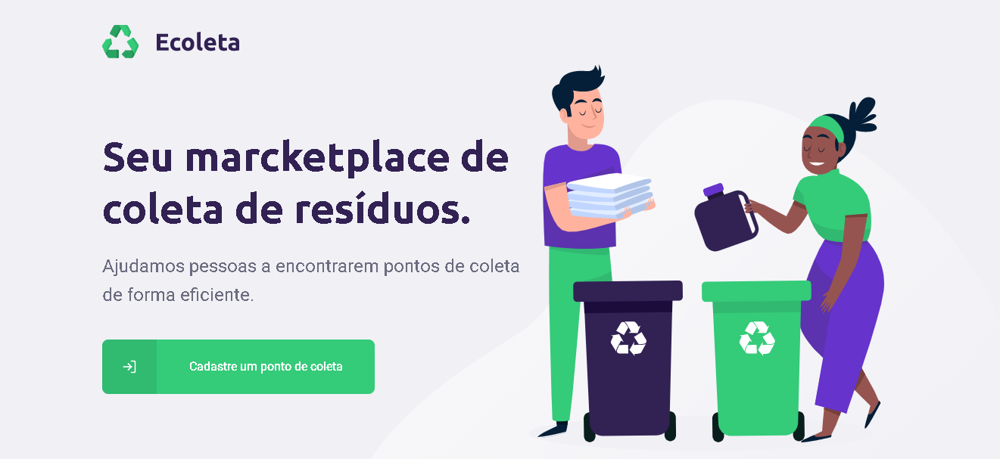

<h1 align="center">
    
</h1>

<h4 align="center"> 
	NextLevelWeek 1.0 🚀
</h4>


<p align="center">
  <a href="#whats-next-level-week">Next Level Week</a>&nbsp;&nbsp;&nbsp;|&nbsp;&nbsp;&nbsp;
  <a href="#-project">Project</a>&nbsp;&nbsp;&nbsp;|&nbsp;&nbsp;&nbsp;
  <a href="#technologies">Technologies</a>&nbsp;&nbsp;&nbsp;|&nbsp;&nbsp;&nbsp;
  <a href="#-layout">Layout</a>&nbsp;&nbsp;&nbsp;|&nbsp;&nbsp;&nbsp;
  <a href="#how-to-use">How to use</a>
</p>

## What's Next Level Week?

NLW is a practical week with lots of code, challenges, networking and a single objective: to take you to the next level.
An online and completely free event that will help you take the next step in your evolution as a dev.

## 💻 Project

Ecoleta is a project developed based on international environment week. 
That aims to connect people to companies that collect specific waste such as light bulbs, batteries, cooking oil, etc.

<h1 align="center">
    
</h1>
<hr/>
Web Example:
<div align="center">
    
</div>
<hr/>
Mobile Example:
<div align="center">
    
</div>
<hr>

## Technologies

This project was developed with the following technologies:

- [Node.js][nodejs]
- [TypeScript][typescript]
- [React][reactjs]
- [React Native][rn]
- [Expo][expo]

## 🔖 Layout

To access the layout use [Figma](https://www.figma.com/file/9TlOcj6l7D05fZhU12xWT3/Ecoleta-(Booster)).

## How To Use

To clone and run this application, you'll need [Git](https://git-scm.com), [Node.js][nodejs] / [Yarn][yarn] installed on your computer.

From your command line:

### Install

```bash
# Clone this repository
$ git clone https://github.com/felipedev1/NLW-01-Booster.git
```

### Install and run API 

```bash
# Go into the repository
$ cd NLW-01-Booster/server

# Install dependencies
$ npm install

# Run Migrates
$ npm run knex:migrate

# Run Seeds
$ npm run knex:seed

# Start server
$ npm run dev
```
### Install and run Web Frontend

```bash
# Go into the repository
$ cd NLW-01-Booster/web

# Install dependencies
$ npm install

# Start App
$ npm start
```
### Install and run Mobile App

```bash
# Go into the repository
$ cd NLW-1.0/mobile

# Install dependencies
$ npm install

# Run
$ npm start
```

[nodejs]: https://nodejs.org/
[typescript]: https://www.typescriptlang.org/
[expo]: https://expo.io/
[reactjs]: https://reactjs.org
[rn]: https://facebook.github.io/react-native/
[yarn]: https://yarnpkg.com/
[vs]: https://code.visualstudio.com/